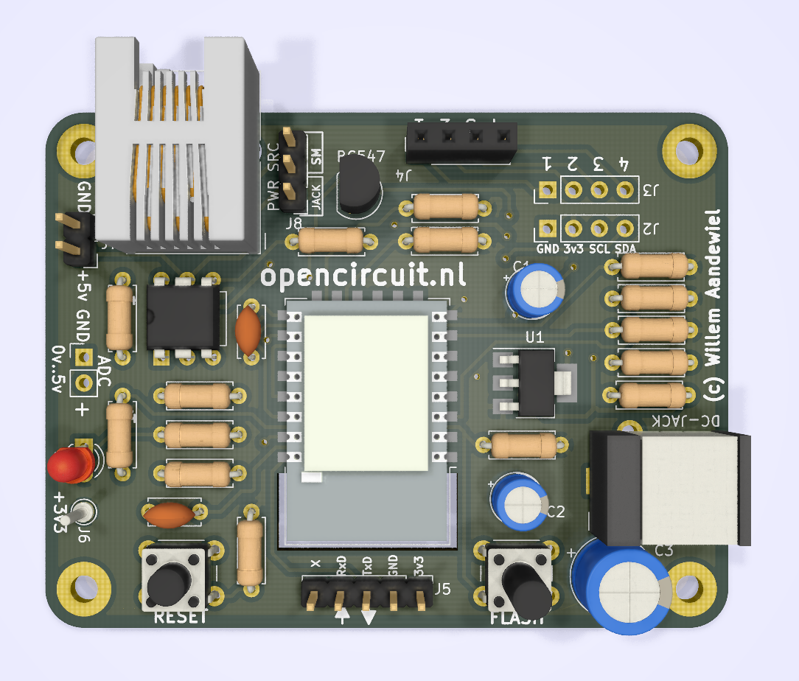

# Documentatie DSMRloggerAPI firmware

### Introductie 

Je vindt hier de documentatie over de DSMRloggerAPI firmware voor versie 4 van de DSMR-logger.


Let op!  
Deze documentatie is "work in progress"!   
Controleer daarom regelmatig op updates.


De DSMR-logger is een hardware en software systeem waarmee de Slimme Meter \(vanaf _DSMR_ versie 4.0\) kan worden uitgelezen. De uitgelezen data \(telegrammen\) worden in de DSMR-logger opgeslagen en kunnen met behulp van gestandaardiseerde restAPI call's worden opgevraagd.

#### Meer informatie

* [Deze post](https://willem.aandewiel.nl/index.php/2018/08/28/slimme-meter-uitlezer/) beschrijft het eerste idee achter de Slimme Meter uitlezer.
* In [deze post](https://willem.aandewiel.nl/index.php/2019/04/09/dsmr-logger-v4-slimme-meter-uitlezer/) kun je de ontwikkeling van de hardware en firmware vinden.
* [Hier](https://willem.aandewiel.nl/index.php/2020/02/28/restapis-zijn-hip-nieuwe-firmware-voor-de-dsmr-logger/) staat een introductie van de DSMRloggerAPI firmware
* Veel informatie over de hardware en het gebruik wordt [hier](https://mrwheel.github.io/DSMRloggerWS/hardware_V4/) beschreven.
* De DSMRloggerAPI firmware kun je op [github](https://github.com/mrWheel/DSMRloggerAPI) vinden.

### Begrippen

In dit document worden de volgende begrippen gebruikt:

| Begrip | Omschrijving |
| :--- | :--- |
| DSMR | [Dutch Smart Meter Requirements](https://nl.wikipedia.org/wiki/Slimme_meter) De [DSMR-specificatie](https://www.netbeheernederland.nl/_upload/Files/Slimme_meter_15_a727fce1f1.pdf) is een afgeleide van de NTA 8130-normering. De DSMR-logger \(versie 4\) is ontworpen voor de _DSMR versie 4.0_ of hoger. Versie 4 geeft aan dat de Slimme Meter op de P1-poort 5 volt bij 250mA moet kunnen leveren \(zie pagina 8 en 9 van de specificatie\). Deze spanning wordt door de DSMR-logger gebruikt om de elektronica te voeden. |
| DSMR-logger | de Hardware \(Let op! Streepje tussen _DSMR_ en _logger_ |
| DSMR-logger v4 \(of Versie 4\) | Versie 4 van de Hardware.  Deze hardware is de basis voor dit project. |
| DSMR-logger v4.5 \(of Versie 4.5\) | [Versie 4.5](https://opencircuit.nl/Product/Slimme-meter-uitlezer-V4.5-Geassembleerd) van de Hardware Deze hardware is een verbetering van de v4 hardware. Standaard heeft deze hardware een 5Volt DC Jack-Plug voor gebruik van een externe voeding en een jumper om de voeding te selecteren vanuit de Slimme Meter of de Jack-Plug. Bij gebruik van de Jack-Plug wordt de 5Volt van de Slimme Meter ontkoppelt. De draadbruggen voor de selectie van de signalen naar een OLED display zijn nu standaard \[GND,3v3,SCL,SDA\] doorverbonden maar deze kunnen, door de verbindingen aan de achterkant van de PCB door te snijden, ook aangepast worden. |
| DSMRloggerAPI | De firmware voor de DSMR-logger v4 Deze firmware maakt intensief gebruik van restAPI's. Let op! De firmware heeft _**geen**_ streepje \(-\) tussen "DSMR" en "logger" |
| ESP-12 | Een bordje met een ESP8266 processor en **4MB** Flash Geheugen Dit bordje wordt gebruikt in de DSMR-logger v4 |

Een volledige beschrijving van dit project kun je [hier](https://willem.aandewiel.nl/index.php/2020/02/28/restapis-zijn-hip-nieuwe-firmware-voor-de-dsmr-logger/) vinden.

