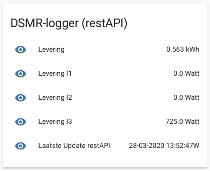

# Beschrijving restAPI's

Alle beschikbare gegevens kunnen via restAPI call's bij de DSMR-logger worden opgevraagd. De restAPI's zijn verdeelt in drie groepen. Informatie die met de hardware en firmware te maken heeft \(`/dev`\), informatie die met de Slimme Meter te maken heeft \(`/sm`\) en historische gegevens die, aan de hand van de door de Slimme Meter afgegeven gegevens, door de DSMR-logger in bestanden worden opgeslagen \(`/hist`\).

* [DSMR-logger gerelateerde restAPI's](dsmr-logger-gerelateerde-restapis.md)
* [Slimme Meter gerelateerde restAPI's](slimme-meter-gerelateerde-restapis.md)
* [Historie gerelateerde restAPI's](historische-gegevens-gerelateerde-restapis.md)

Een restAPI kan op verschillende manieren worden aangeroepen.

### Javascript

```text
    fetch("http://dsmr-api.local/api/v1/dev/time")
      .then(response => response.json())
      .then(json => {
        console.log("parsed .., data is ["+ JSON.stringify(json)+"]");
        for( let i in json.devtime ){
            if (json.devtime[i].name == "time")
            {
              console.log("Got new time ["+json.devtime[i].value+"]");
              document.getElementById('theTime').innerHTML = json.devtime[i].value;
            }
          }
      })
      .catch(function(error) {
        var p = document.createElement('p');
        p.appendChild(
          document.createTextNode('Error: ' + error.message)
        );
      });     

```


### Unix command

```text
curl http://dsmr-api.local/api/v1/dev/time
```

Geeft dit als output:

```text
{"devtime":[
   {"name": "time", "value": "2020-03-23 11:45:40"},
   {"name": "epoch", "value": 1584963941}
]}
```

 

### Home Assistant

configuration.yaml:

```text
### configuration.yaml
### DSMRloggerAPI 
  - platform: rest
    name: "Levering"
    resource: http://<ip-dsmr-logger>/api/v1/sm/fields/power_returned
    unit_of_measurement: "kWh"
    value_template: '{{ value_json.fields[1].value | round(3) }}'

  - platform: rest
    name: "Laatste Update restAPI"
    resource: http://192.168.2.106/api/v1/sm/fields/timestamp
#   value_template: '{{ value_json.fields[0].value }}'
    value_template: >
      {{      value_json.fields[0].value[4:6] + "-" + 
              value_json.fields[0].value[2:4] + "-" + 
         "20"+value_json.fields[0].value[0:2] + "   " + 
              value_json.fields[0].value[6:8] + ":" + 
              value_json.fields[0].value[8:10] + ":" + 
              value_json.fields[0].value[10:13] }}

  - platform: rest
    name: "Levering l1"
    resource: http://192.168.2.106/api/v1/sm/fields/power_returned_l1
    unit_of_measurement: "kWh"
    value_template: '{{ value_json.fields[1].value | round(3) }}'

  - platform: rest
    name: "Levering l2"
    resource: http://192.168.2.106/api/v1/sm/fields/power_returned_l2
    unit_of_measurement: 'Watt'
    value_template: '{{ value_json.fields[1].value | round(3) }}'

  - platform: rest
    name: "Levering l3"
    resource: http://192.168.2.106/api/v1/sm/fields/power_returned_l3
    unit_of_measurement: 'Watt'
    value_template: '{{ value_json.fields[1].value | round(3) }}'

```

geeft dit resultaat:




Met hassOS lukt het mij niet om bij resource de hostname \(DSMR-API.local\) te gebruiken. Met het IP adres lukt het wel.


### 

### Andere systemen

Veel andere systemen, zoals bijvoorbeeld hebben hun eigen manier om restAPI's op te vragen. Lees hiervoor de betreffende documentatie.

