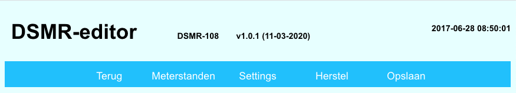
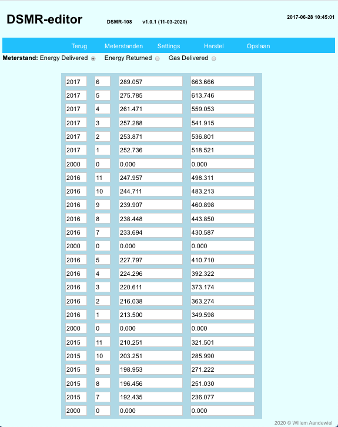
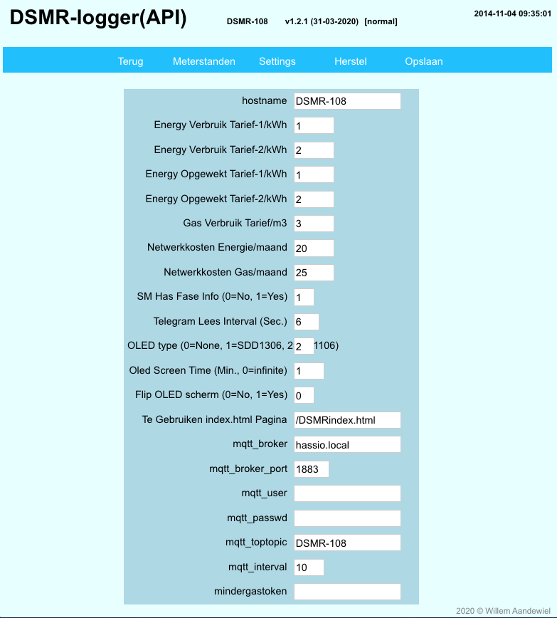

# DSMR-editor

De DSMRloggerAPI heeft de mogelijkheid om meterstanden en instellingen via de browser te veranderen.

Je start de **`DSMR-editor`** door in het hoofdscherm op het  icoontje te klikken.

Betekenis van de knoppen:

* **Terug**: Terug naar het hoofdscherm van de DSMR-logger
* **Meterstanden**: Hier kunnen, per maand, de meterstanden worden ingevoerd. Er kan gekozen worden tussen de meterstanden van de gebruikte energie, de opgewekte energie en het gas verbruik.
* **Settings**: Hier kunnen bepaalde parameters zoals de energie tarieven, interval voor het lezen van telegrammen, gegevens van de MQTT broker en het autorisatie token van Mindergas.nl worden ingesteld.
* **Herstel**: ingevoerde veranderingen die nog niet zijn opgeslagen worden teniet gedaan.
* **Opslaan**: de ingevoerde gegevens worden opgeslagen

### Meterstanden aanpassen

Het muteren van de maanden tabel is nog niet helemaal zoals het zou moeten zijn. Het is vrij lastig omdat de software zeker moet zijn dat de _jaar/maand_ gegevens, van boven naar beneden, _aflopen en aansluiten_ en ook de meterstanden moeten _een steeds lagere waarde_ hebben. Wordt niet aan voorgaande inter-validatie voldaan, dan kleurt het vakje waar de fout is ontdekt rood en worden de gegevens **niet** opgeslagen.

### Settings aanpassen

#### Hostname

De default Hostname is DSMR-API. De documentatie gaat ook uit van deze default hostname. Mocht je de hostname hier veranderen dan moet je bij het lezen van de documentatie overal "_**DSMR-API**_" vervangen door de hier ingevoerde hostname \(in bovenstaand plaatje is de hostname veranderd in "_**DSMR-108**_"\).

#### SM Has Fase Info \(0=No, 1=Yes\)

Voer een **1** in als de aangesloten Slimme Meter wél fase informatie afgeeft, voer anders een **0** \(nul\) in.

#### Telegram Lees Interval

Default interval is 10. Dit betekent dat er iedere tien seconden een interval wordt gelezen en verwerkt. De minimum waarde is 2 seconden.

#### Te gebruiken index.html pagina

De standaard index pagina is "_DSMRindex.html_". Mocht je zelf een GUI schrijven dan kun je hier de naam van de index pagina van jouw GUI invullen. Standaard staan er ook een **DSMRindexEDGE.html** en een **ADJindex.html** pagina op SPIFFS. De eerste variant is gelijk aan de _DSMRindex.html_ pagina maar hij haalt de _javascript_ en _css_ bestanden uit de github repository zodat aanpassingen \(uitbreidingen of verbeteringen\) automatisch door de DSMR-logger gebruikt worden. Het **ADJindex.html** bestand is een bootstrap naar de door [Arjen de Jong](https://github.com/arjendejong12/DSMRloggerGUI) gemaakte GUI.


Een nieuw ingevoerde index pagina wordt pas actief na het opnieuw opstarten van de DSMR-logger \(\[ReBoot\] knop in de FSexplorer\).


#### OLED type

Hier kun je invoeren óf en wat voor OLED schermpje op de DSMR-logger is aangesloten.

* Voer een **0** \(nul\) in als er geen OLED scherm is aangesloten
* Voer een **1** in als het scherm van het type **SDD1306** is
* Voer een **2** in als het scherm van het type **SH1106** is

#### MQTT Top Topic

Dit is het topic waarmee de MQTT berichten naar de broker worden verstuurd. Standaard is het Top Topic "_**DSMR-API**_". In bovenstaand plaatje is het Top Topic veranderd in "_**DSMR-PRD**_".

#### Verzend MQTT berichten

Hier kun je opgeven hoe vaak de DSMR-logger een bericht naar de MQTT broker moet sturen. Voer je hier '0' \(nul\) in dan worden er géén berichten naar de MQTT broker verstuurd. Een waarde kleiner dan de _Telegram Lees Interval_ zorgt ervoor dat na ieder gelezen telegram een bericht naar de MQTT broker wordt verstuurd.

