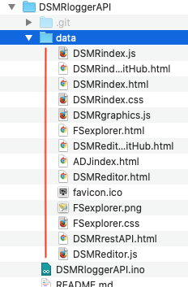
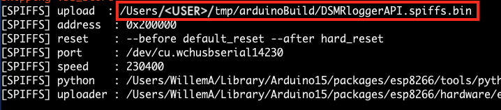

# Data map Flashen

In de **`data`**-map van de DSMRloggerAPI firmware staan bestanden die nodig zijn voor het functioneren van de firmware.

Deze bestanden moeten dan ook overgezet worden naar de DSMR-logger. Dat '_overzetten_' kan op twee manieren: _'**Bedraad**'_ en _'**Over The Air**'_

#### Bedraad 


Pas op!  
Koppel de DSMR-logger los van de Slimme Meter vóórdat je de DSMR-logger op de programmer aansluit!!


1. Sluit de programmer aan op de _DSMR-logger v4_.
2. Druk op de **`FLASH`** knop en houdt deze ingedrukt.
3. Druk vervolgens de **`RESET`** knop in en laat deze weer los.
4. Laat nu ook de **`FLASH`** knop los.

De _DSMR-logger v4_ staat nu in "_Flash-mode_" en wacht \(geduldig\) tot de inhoud van de **`data`** map wordt opgestuurd.

* Ga in de Arduino IDE naar **`Tools` -&gt; `ESP8266 Sketch Data Upload`**


Let op!  
Het uploaden van de data map mislukt als de Serial Monitor  open staat!


SPIFFS wordt nu leeg gemaakt en alle bestanden in de **`data`** map worden naar het SPIFFS overgezet.

Hierna zal de DSMR-logger normaal opstarten, maar met de nieuw SPIFFS inhoud.


Let op!  
Hou er rekening mee dat eventuele data-bestanden die al op SPIFFS stonden nu weg zijn! Als je ze niet kwijt wil moet je er eerst een kopie van maken op je computer en deze, na het flashen van SPIFFS weer terug zetten \(dat kan met de DSMR-logger FSexplorer \)!


#### Over The Air 

Bij het _**Over The Air**_ uploaden van de bestanden uit de **`data`**-map kan de `DSMRlogger v4` gewoon aan de Slimme Meter gekoppeld blijven.

Alle **`Board`** gegevens blijven gelijk alleen selecteer je een **`Serial Port`** die **nergens op is aangesloten**!

Start vervolgens het `ESP8266 Sketch Data Upload`-tool

Omdat je een **`Serial Port`** hebt geselecteerd waar niets op is aangesloten zal deze opdracht met een foutmelding eindigen.  
Ondertussen is er wél een **`.spiffs.bin`** bestand in het **`build-path`** neergezet.


Let op!  
Hou er rekening mee dat eventuele data-bestanden die al op SPIFFS stonden nu weg zijn! Als je ze niet kwijt wil moet je er eerst een kopie van maken op je computer en deze, na het flashen van SPIFFS weer terug zetten \(dat kan met de DSMR-logger FSexplorer \)!


Klik nu op de DSMR-logger pagina op het  icoontje.

In de FSexplorer klik je op de knop **`Update Firmware`**

Er verschijnt nu een scherm waarin je een SPIFFS bestand \(de naam eindigt op **`.spiffs.bin`**\) kunt kiezen door op de onderste knop **`Choose File`** te klikken.

Selecteer uit het `popUp scherm` dat nu verschijnt het binary file dat je wilt uploaden ..

.. klik op \[Open\] en daarna op de knop **`Flash Spiffs`**

Na enige tijd krijg je de melding dat de upload is geslaagd en dat de DSMR-logger opnieuw opstart.


Let op!  
Het komt regelmatig voor dat het scherm niet automatisch ge-refreshed wordt \(dit lijkt te maken te hebben met de omvang van de firmware die je upload\). Klik in dat geval, na ongeveer 3 minuten, op de tekst "_**hier**_"  
  
      Als het lijkt of er niets gebeurd, wacht dan ongeveer drie minuten en klik daarna **hier**.  
  
Als de verbinding met de server vóór die tijd verbroken wordt klik dan op de \[back\] knop van de browser waarna de tekst alsnog \(weer\) verschijnt. Klik nu op _**hier**_ om de DSMRloggerAPI hoofd pagina opnieuw te laden.


