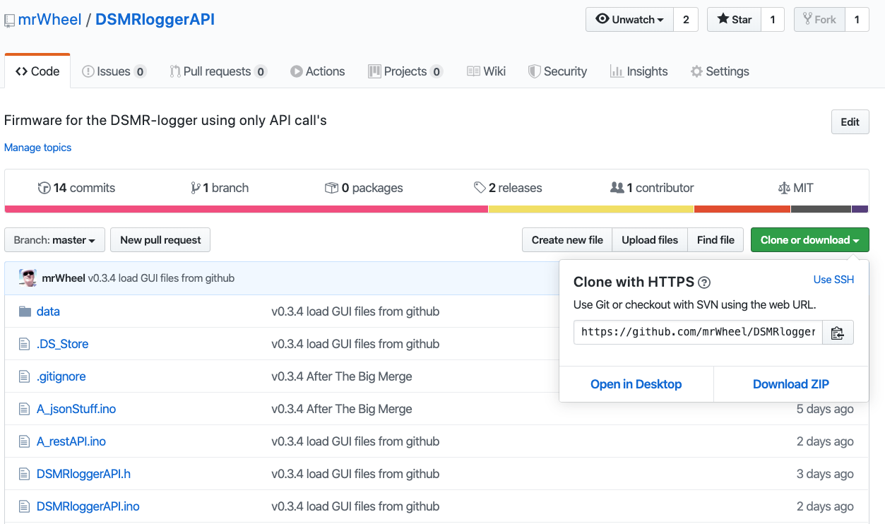
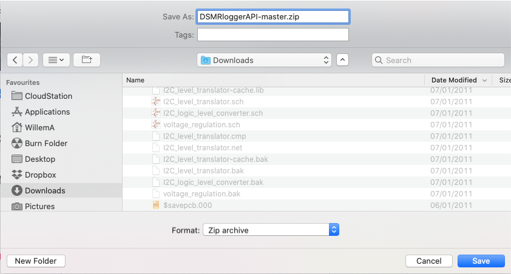
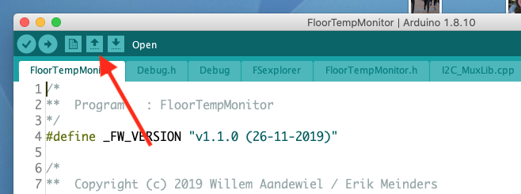

# DSMRloggerAPI Firmware

### Clonen Firmware <a id="clonen-firmware"></a>

De **DSMRloggerAPI** firmware staat hier [https://github.com/mrWheel/DSMRloggerAPI](https://github.com/mrWheel/DSMRloggerAPI). Er zijn twee manieren om de firmware te clonen.

1. download de repository als een **`.zip`** file
2. gebruik **`git`**

Als je niet handig bent met **`git`** raad ik je aan de repository als een **`.zip`** file te downloaden.

#### Download .zip file <a id="download-zip-file"></a>



Klik op de groene knop \[Clone or Download\] ..


.. en selecteer \[Download ZIP\]

Er volgt een scherm als dit:



1. Bewaar het **`.zip`** bestand op een plek op je computer waar je hem terug kunt vinden.
2. Unzip het **`DSMRloggerAPI-master.zip`** bestand in de ArduinoIDE **`Sketchbook Location`**.
3. Rename de map **`DSMRloggerAPI-master`** naar **`DSMRloggerAPI`** \(dus zonder **`-master`**\)

Ga verder naar [_**DSMRloggerAPI Sketch openen**_](dsmrloggerapi-firmware.md#dsmrloggerws-sketch-openen)_\*\*\*\*_

#### git clone <a id="git-clone"></a>

Om de repository met **`git`** te kunnen clonen moet je er éérst voor zorgen dat je **`git`** op je systeem hebt staan. Hoe je dat moet doen valt buiten de scope van deze documentatie maar [hier](https://git-scm.com/book/nl/v1/Aan-de-slag-Git-installeren) kun je alles vinden over hoe je dit, voor jouw systeem, moet doen.

Voor nu ga ik ervan uit dat je **`git`** op je systeem hebt staan en dat je weet hoe je ermee moet werken.

Ga naar de Arduino **`Sketchbook location`** \(de map waar al je Sketches in staan, [kijk hier](../voorbereiding/esp8266-core.md)\) en toets het volgende commando in:

```text
git clone https://github.com/mrWheel/DSMRloggerAPI.git
```

That's it!

In **`Sketchbook location`** staat hierna een nieuwe map met de naam **`DSMRloggerAPI`**.

#### DSMRloggerAPI Sketch openen <a id="dsmrloggerws-sketch-openen"></a>

Start de ArduinoIDE _**opnieuw**_ op en klik op het `open` icoon.



Selecteer in het `drop-down` menu ..


.. de sketch **`DSMRloggerAPI`**\(In jouw situatie staat deze firmware waarschijnlijk niet onder een submap "SlimmeMeter"!\)  
Er verschijnt een nieuw editor window met de firmware van de DSMRlogger!


