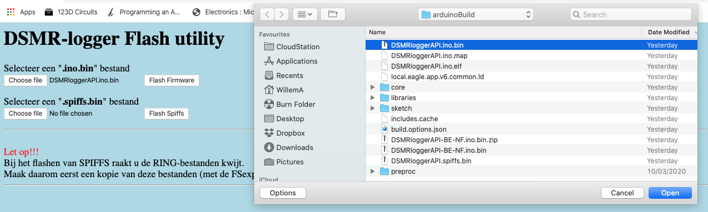

# Firmware Flashen

Versie 4 van de DSMR-logger hardware maakt gebruik van een ESP-12 processor. Deze processor zit op de printplaat van de DSMR-logger gesoldeerd en moet dus, op de printplaat, geflashed worden.

Om de firmware naar de **DSMR-logger Versie 4** te kunnen flashen moet deze eerst voor deze versie van de DSMR-logger geschikt worden gemaakt.

Dit doe je door in de ArduinoIDE de **`#define`**'s in het eerste tab-blad aan te passen.

```text
/******************** compiler options  ********************************************/
#define IS_ESP12                  // define if it's a 'bare' ESP-12 (no reset/flash functionality on board)
#define USE_UPDATE_SERVER         // define if there is enough memory and updateServer to be used
//  #define USE_BELGIUM_PROTOCOL      // define if Slimme Meter is a Belgium Smart Meter
//  #define USE_PRE40_PROTOCOL        // define if Slimme Meter is pre DSMR 4.0 (2.2 .. 3.0)
//  #define USE_NTP_TIME              // define to generate Timestamp from NTP (Only Winter Time for now)
//  #define SM_HAS_NO_FASE_INFO       // if your SM does not give fase info use total delevered/returned
//  #define HAS_NO_SLIMMEMETER        // define for testing only!
#define USE_MQTT                  // define if you want to use MQTT
#define USE_MINDERGAS             // define if you want to update mindergas (also add token down below)
//  #define USE_SYSLOGGER             // define if you want to use the sysLog library for debugging
//  #define SHOW_PASSWRDS             // well .. show the PSK key and MQTT password, what else?
/******************** don't change anything below this comment **********************/

```

Vervolgens moeten de `Boards` settings als volgt worden ingevuld:

|  | Instelling | Waarde |
| :--- | :--- | :--- |
|  | Board | "Generic ESP8266 Module" |
|  | Upload Speed | "115200" |
|  | CPU Frequency | "80MHz" |
|  | Flash Frequency | "40MHz" |
|  | Flash Mode | "DIO" of "DOUT \(compatible\)" |
|  | Flash Size | "4MB \(**FS: 2MB** OAT:~1019KB\)" **&lt;&lt;== let op! 2MB** |
|  | Crystal Frequency | "26MHz" |
|  | Reset Method | "None" |
|  | Debug Port | "Disabled" |
|  | Debug Level | "None" |
|  | IwIP Variant | "v2 Lower Memory" |
|  | VTables | "Flash" |
|  | Exeptions | "Disabled" |
|  | Builtin Led | "2" |
|  | Erase Flash | "Only Sketch" \(First Time: "All Flash Contents"\) |
|  | Port | Bedraad: "Serial Port" |


Let op!  
Als je de **Flash Mode** veranderd t.o.v. wat je gebruikt hebt voor de firmware die nu in de DSMR-logger zit en je doet een OTA update van de firmware, dan zal de Flash Mode pas veranderen na een power cycle!



#### Firmware Bedraad Flashen <a id="firmware-bedraad-flashen"></a>


Pas op!  
Koppel de DSMR-logger los van de Slimme Meter vóórdat je de DSMR-logger op de programmer aansluit!!



Sluit de [USB-&gt;ESP12 programmer](https://mrwheel.github.io/DSMRloggerWS/hardware_V4_Programmer/) aan op de `Program`-header van de _DSMR-logger v4_

1. Druk de **`FLASH`** knop in en houd deze ingedrukt
2. Druk op de **`RESET`** knop
3. Laat de **`RESET`** knop los
4. Laat de **`FLASH`** knop los

De _DSMR-logger v4_ staat nu in Flash-mode en blijft in die mode tot er gegevens vanaf de programmer naar de DSMR-logger zijn overgebracht óf tot je nog een keer op de **`RESET`** knop drukt.

Vergeet niet in de Arduino IDE de **`Port`** te selecteren waarop je de USB-&gt;ESP12 programmer hebt aangesloten en druk op het _Compile and Upload_ icoon.


#### Firmware _Over The Air_ Flashen <a id="firmware-over-the-air-flashen"></a>

Bij het _Over The Air_ flashen van de firmware of **`data`**-map kan \(moet\) de DSMR-logger v4 gewoon op de Slimme Meter aangesloten blijven.

Alle instellingen voor de DSMRloggerAPI firmware blijven gelijk aan de bedrade methode van flashen.

Vervolgens moet je niet op het   **`Compile & Upload`**-Icoon     

klikken maar in het \[**`Sketch`**\] drop-down menu de keuze **`Upload Compiled Binary`** selecteren.


De firmware wordt nu gecompileerd en in de Arduino Sketch map waar de DSMRloggerAPI firmware ook staat neergezet. Het bestand heeft de extensie **`.bin`**.

Als de firmware gecompileerd is klik je op de DSMR-logger pagina op het  icoontje.


In de FSexplorer klik je op de knop **`Update Firmware`**

Er verschijnt nu een scherm waarin je een firmware bestand \(de naam eindigt op **`.bin`** met ergens in de naam ook **`.ino.`**\) kunt kiezen door op de bovenste knop **`Choose File`** te klikken.


Selecteer uit het **`popUp scherm`** dat nu verschijnt het binary file dat je wilt uploaden ..



.. klik op \[Choose\] \(of \[Open\]\) en daarna op de knop **`flash Firmware`** 


Let op!  
De firmware heeft áltijd "**.ino.**" in de naam en eindigt áltijd op "**.bin**"!



Na enige tijd krijg je de melding dat de upload is geslaagd en dat de DSMR-logger opnieuw opstart.


Let op!  
Het komt soms voor dat het scherm niet automatisch ge-refreshed wordt. Klik in dat geval, na ongeveer 3 minuten, op de tekst "_hier_"  
  
      _Als het lijkt of er niets gebeurd, wacht dan ongeveer drie minuten en klik daarna **hier**_.  
  
Als de verbinding met de server vóór die tijd verbroken wordt klik dan op de \[back\] knop van de browser waarna de tekst alsnog \(weer\) verschijnt. Klik nu op _**hier**_ om de DSMRloggerAPI hoofd pagina opnieuw te laden.



