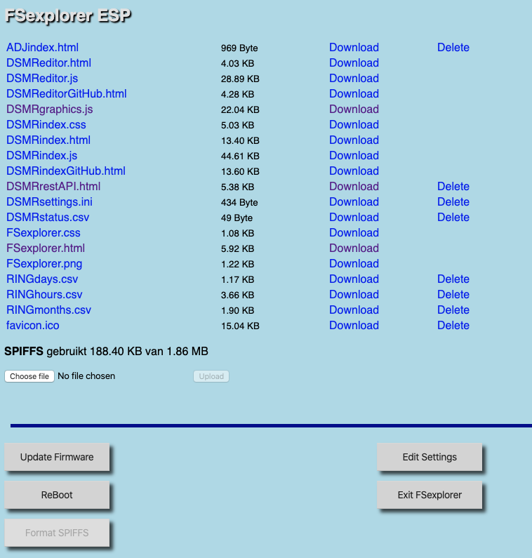

# FSexplorer

Met de FSexplorer is het mogelijk bestanden op het SPIFFS \(SPI Flash File System\) te plaatsen of ze ervan te verwijderen. Ook kan de inhoud van bestanden die aanwezig zijn op het SPIFFS worden getoond \(dit is niet mogelijk met .html bestanden omdat deze direct door de browser geïnterpreteerd -en dus uitgevoerd- worden\).

Daarnaast kent de FSexplorer nog de volgende functies:

* Starten van de Update Server    \[UpdateFirmware\]
* Rebooten van de DSMR-logger     \[ReBoot\]
* Formatteren van het SPIFFS     \[Format SPIFFS\]

Er zijn verschillende manieren om de FSexplorer te starten:

* Vanuit het DSMR-logger hoofdscherm door op het icoon  te klikken
* Door in de browser de volgende URL in te toetsen           `http://dsmr-api.local/FSexplorer` of:          `http://<ipAdresVanDeLogger>/FSexplorer`

### Het SPIFFS formatteren

De FSexplorer heeft de mogelijkheid om het SPIFFS te formatteren. Deze functie is alleen nodig als het SPIFFS problemen vertoont. Normaal gesproken is deze functie nooit nodig en daarom is de knop ook uitgeschakeld. Om de knop te activeren moet er een bestand met de exacte naam **`!format`**\(het eerste teken is een uitroep-teken\) ge-upload worden. De inhoud van het bestand is niet belangrijk. Zodra dit bestand aanwezig is wordt de \[Format SPIFFS\] knop geactiveerd.


Pas op!  
Door het SPIFFS te formatteren raak je álle bestanden die op het SPIFFS staan kwijt!  
Maak zo nodig eerst kopiëren van belangrijke bestanden.


