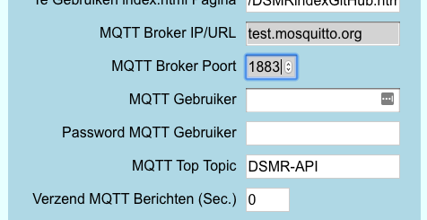

# USE\_MQTT

Met deze optie wordt de functionaliteit om data naar een MQTT Broker te sturen geactiveerd.

Via **`FSexplorer -> Edit instellingen -> Settings`** kun je gegevens over de te gebruiken MQTT Broker invullen:



<table>
  <thead>
    <tr>
      <th style="text-align:left">Rubriek</th>
      <th style="text-align:left">Functie</th>
    </tr>
  </thead>
  <tbody>
    <tr>
      <td style="text-align:left">MQTT broker URL/IP</td>
      <td style="text-align:left">Vul hier de URL of het IP adres van de MQTT broker in.
        <br />Voorbeeld: &quot;<b>test.mosquitto.org</b>&quot;
        <br />
      </td>
    </tr>
    <tr>
      <td style="text-align:left">MQTT Poort</td>
      <td style="text-align:left">
        <p>Het default poortnummer is 1883.</p>
        <p>Hou er wel rekening mee dat de ESP8266 geen encryptie aan kan!</p>
      </td>
    </tr>
    <tr>
      <td style="text-align:left">MQTT Username</td>
      <td style="text-align:left">Vul hier de naam in van de gebruiker van de MQTT broker.</td>
    </tr>
    <tr>
      <td style="text-align:left">MQTT Password</td>
      <td style="text-align:left">Als de MQTT broker gebruiker een wachtwoord nodig heeft vul die dan hier
        in.</td>
    </tr>
    <tr>
      <td style="text-align:left">MQTT Interval (sec.)</td>
      <td style="text-align:left">
        <p>De Interval geeft aan om de hoeveel seconden de DSMR-logger gegevens naar
          de MQTT broker moet sturen.
          <br />De DSMRloggerAPI firmware zal nooit vaker een MQTT bericht versturen dan
          de interval waarmee telegrammen worden gelezen. Voer je een interval in
          die kleiner is dan de telegram interval dan zal er, na het lezen van een
          telegram direct een MQTT bericht worden verzonden.</p>
        <p>Voer je hier 0 (nul) in dan worden er g&#xE9;&#xE9;n MQTT berichten verzonden.</p>
      </td>
    </tr>
    <tr>
      <td style="text-align:left">MQTT TopTopic</td>
      <td style="text-align:left">Dit is het topic waaronder alle andere gegevens worden gepubliceerd. Standaard
        is dit &quot;DSMR-API&quot;.</td>
    </tr>
  </tbody>
</table>De DSMR-logger zal iedere `MQTT Interval` seconden de volgende berichten naar de MQTT Broker sturen:

```text

DSMR-API/identification {"identification":"XMX5LGBBLB2410065887"}
DSMR-API/p1_version {"p1_version":"50"}
DSMR-API/timestamp {"timestamp":"140223173001S"}
DSMR-API/equipment_id {"equipment_id":"4530303336303000000000000000000040"}
DSMR-API/energy_delivered_tariff1 {"energy_delivered_tariff1":170.899,"unit":"kWh"}
DSMR-API/energy_delivered_tariff2 {"energy_delivered_tariff2":163.798,"unit":"kWh"}
DSMR-API/energy_returned_tariff1 {"energy_returned_tariff1":113.378,"unit":"kWh"}
DSMR-API/energy_returned_tariff2 {"energy_returned_tariff2":76.650,"unit":"kWh"}
DSMR-API/electricity_tariff {"electricity_tariff":"0001"}
DSMR-API/power_delivered {"power_delivered":1.230,"unit":"kW"}
DSMR-API/power_returned {"power_returned":1.770,"unit":"kW"}
DSMR-API/voltage_l1 {"voltage_l1":237.0,"unit":"volt"}
DSMR-API/voltage_l2 {"voltage_l2":238.0,"unit":"volt"}
DSMR-API/voltage_l3 {"voltage_l3":235.0,"unit":"volt"}
DSMR-API/current_l1 {"current_l1":2,"unit":"ampere"}
DSMR-API/current_l2 {"current_l2":2,"unit":"ampere"}
DSMR-API/current_l3 {"current_l3":0,"unit":"ampere"}
DSMR-API/power_delivered_l1 {"power_delivered_l1":874,"unit":"Watt"}
DSMR-API/power_delivered_l2 {"power_delivered_l2":336,"unit":"Watt"}
DSMR-API/power_delivered_l3 {"power_delivered_l3":17,"unit":"Watt"}
DSMR-API/power_returned_l1 {"power_returned_l1":1066,"unit":"Watt"}
DSMR-API/power_returned_l2 {"power_returned_l2":274,"unit":"Watt"}
DSMR-API/power_returned_l3 {"power_returned_l3":427,"unit":"Watt"}
DSMR-API/gas_device_type {"gas_device_type":"3"}
DSMR-API/gas_equipment_id {"gas_equipment_id":"4730303339303031363532303530323136"}
DSMR-API/gas_delivered {"gas_delivered":119.69,"unit":"m3"}

```

Voor de Mosquitto client kun je de berichten volgen met het volgende commando:

**`mosquitto_sub -h test.mosquitto.org -v -t 'DSMR-API/#'`**

of, als je een username/password hebt ingesteld met dit commando:

**`mosquitto_sub -h test.mosquitto.org -u <username> -P <password> -v -t 'DSMR-API/#'`**

| \#define | Functie |
| :--- | :--- |
| USE\_MQTT | Deze define zorgt ervoor dat de Firmware data uit de Slimme Meter naar een MQTT Broker stuurt. |

