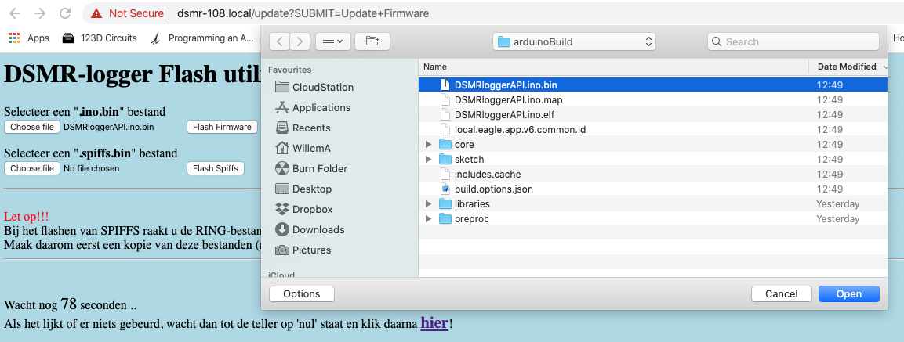
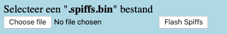
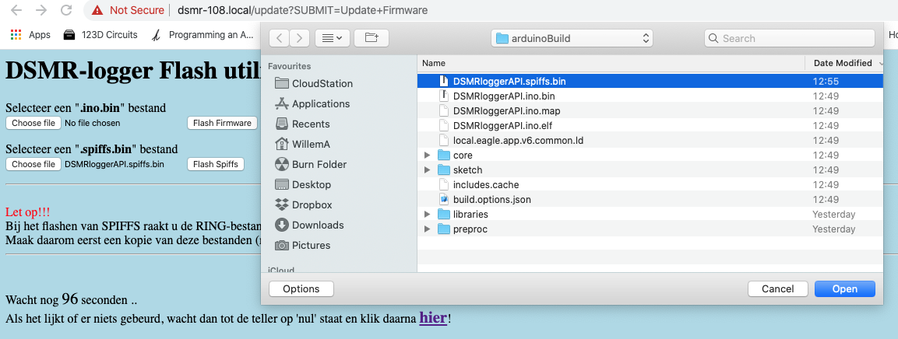
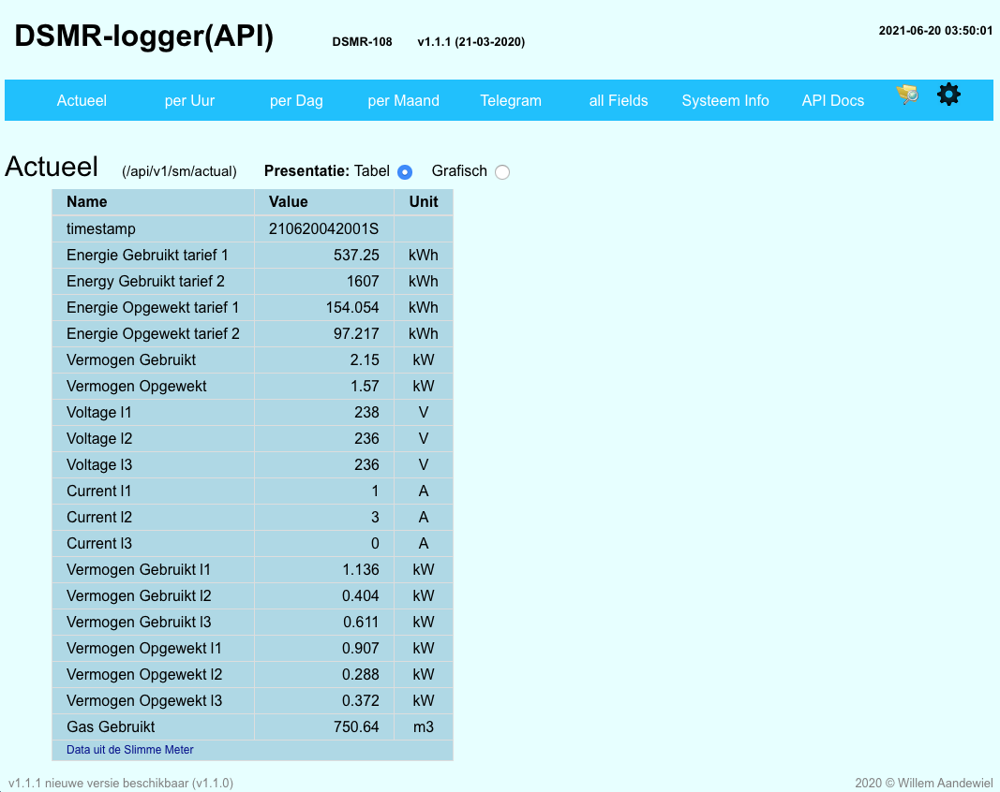
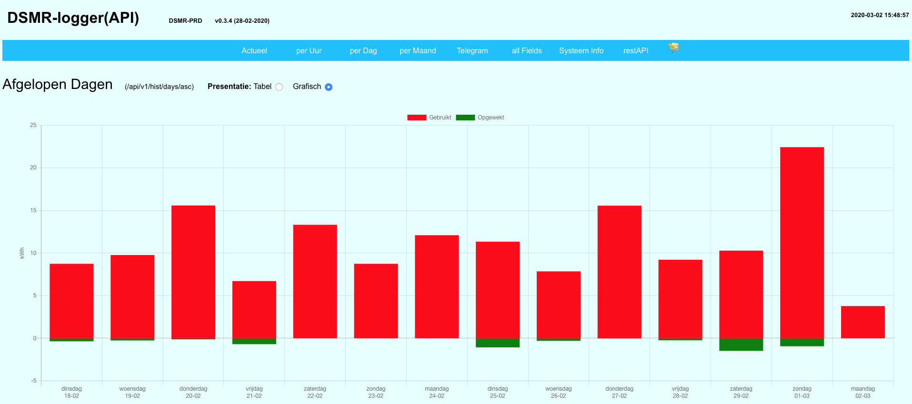

# Upgrade DSMRloggerWS naar DSMRloggerAPI

[Deze video](https://youtu.be/Pq-Zm-o8Xo8) laat zien hoe je de _DSMRlogger**WS**_ firmware eenvoudig kunt upgraden naar de nieuwe _DSMRlogger**API**_ firmware.


Je kunt deze upgrade maar één maal uitvoeren!  
Nadat de upgrade is uitgevoerd \(en als het is gelukt\) kun je nieuwe versies van de DSMRloggerAPI firmware via de [normale](nieuwe-dsmrloggerapi-firmware-flashen.md) weg updaten!


Het upgraden vanaf de _DSMRlogger**WS**_ firmware naar de _DSMRlogger**API**_ ****firmware bestaat uit de volgende stappen:

* Gebruik de FSexplorer om de **`PRDhours.csv`, `PRDdays.csv`** en **`PRDmonths.csv`** naar je computer te downloaden \(dit hoef je alleen te doen als je de opgebouwde historie na de upgrade terug wilt zien in de GUI van de DSMR-logger met de nieuwe firmware\).

* Download de DSMRloggerAPI.ino.bin.zip en DSMRloggerAPI.spiffs.bin.zip files van [github](https://github.com/mrWheel/DSMRloggerAPI/releases) naar je computer.
* Unzip de twee .zip bestanden
* Verwijder het bestand **`DSMRsettings.ini`** van de DSMR-logger \(gebruik weer de FSexplorer\). **Pas op!** _Sla deze stap niet over_!!
* Klik op de knop \[Update Firmware\], selecteer  met \[Choose File\] het goede firmware bestand \(DSMRloggerAPI**.ino.bin**\) en flash eerst deze nieuwe firmware door op de knop \[Flash Firmware\] te klikken.

* Wacht na de boodschap dat de update goed is gegaan tot de teller op 10 staat en klik dan in de browser op \[Back\] of tik in de URL-balk het IP-Adres van de DSMR-logger in met daarachter "**`/update`**". Je komt nu weer in het scherm waar je nieuwe firmware kunt flashen.
* Klik nu op de knop \[Update Firmware\], selecteer  door op \[Choose File\] te klikken het DSMRlogger.**spiffs.bin** bestand en klik op de knop \[Flash Spiffs\]. 

  
 Als het flashen goed is gegaan verschijnt na enige tijd het start scherm van de DSMR-logger.

De DSMRloggerAPI firmware heeft een mogelijkheid om bestanden van de DSMRloggerWS \(zgn. **`PRD-bestanden`**\) automatisch te converteren naar het door de DSMRloggerAPI gebruikt \(_RING_\) formaat.

Nadat je de DSMRloggerAPI hebt geïnstalleerd en deze 'werkt' kun je met de **`FSexplorer`** de drie bewaarde **`PRD-bestanden`** naar het SPIFFS uploaden.

Upload vervolgens een bestand met de exacte naam **`!PRDconvert`** \(het eerste teken is een uitroep-teken\) naar het SPIFFS \(de inhoud van dit bestand is niet belangrijk\). Start de DSMR-logger nu opnieuw op \(klik op de knop \[ReBoot\]\) en de RING bestanden zullen automatisch gevuld worden met de inhoud van de PRD bestanden.


Let op!   
Je moet ervoor zorgen dat de PRD bestanden _**zo actueel mogelijk**_, maar in ieder geval _**binnen dezelfde dag**_ en bij voorkeur _**in hetzelfde uur**_ waarop je de conversie uitvoert, nog ge-update zijn!   
Missen er uren of dagen dan geeft dit vreemde resultaten \(maar dat komt na verloop van tijd vanzelf goed\)!


